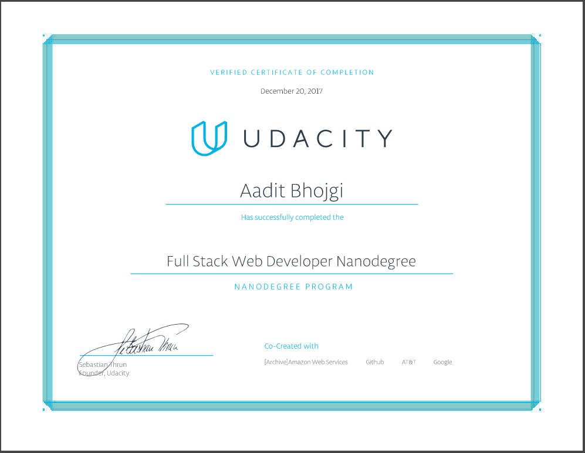

# Full Stack Web-Developer Nanodegree (Udacity)
#### by<a href="https://in.udacity.com/"> Udacity Inc.</a>

This repo contains all the projects I created while doing the Full Stack Nanodegree at Udacity.

### Knowledge Required:
* Creating responsive **HTML web pages**.
* Generating web pages programmatically using **Python**.
* Deploying applications on a web server like **Heroku**.
* Creating complex Web Apps using Python's **Flask MicroFramework**.
* Working with **MV\* Frameworks**.
* Creating and Using Mutliple **APIs**.
* Configuring and maintaining a **Linux server**.

### Below is the certificate after graduating:
